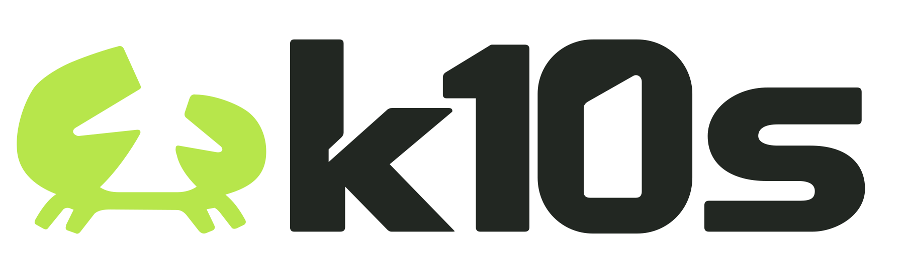
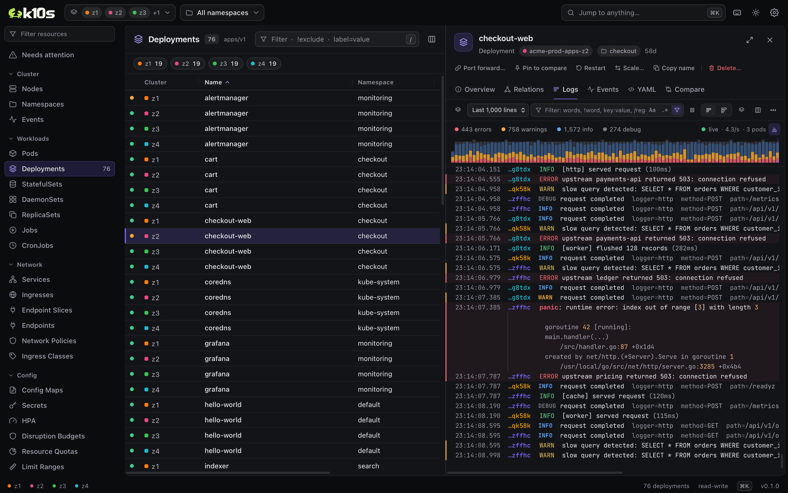
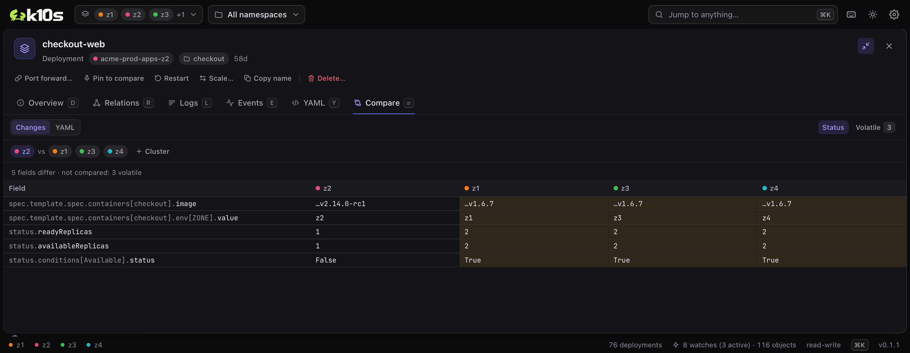
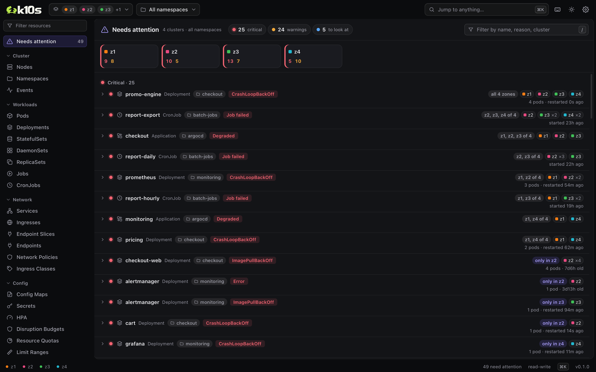
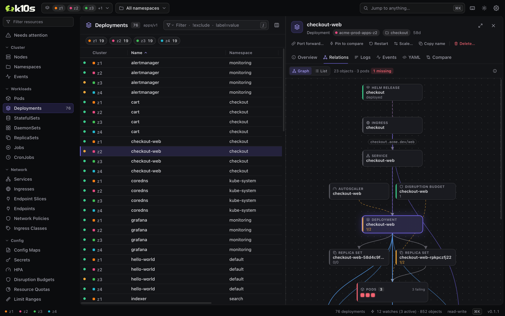
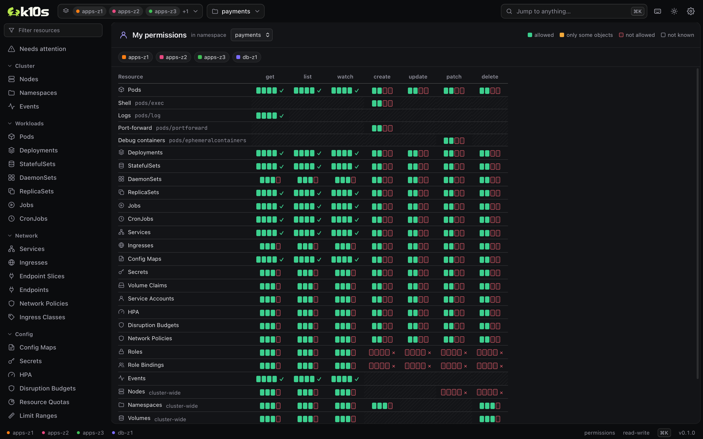
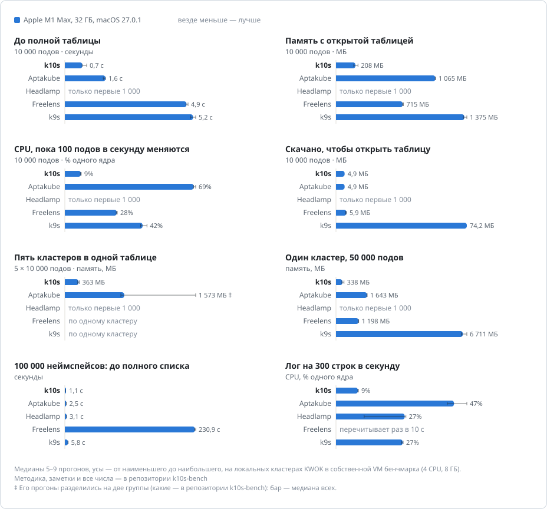

<p align="center">
  <picture>
    <source media="(prefers-color-scheme: dark)" srcset="branding/k10s-lockup-light.svg">
    
  </picture>
</p>

<p align="center">
  <b>Быстрый десктопный клиент для парка Kubernetes-кластеров.</b><br>
  Все кластеры в одной живой таблице. Для тех, у кого нет cluster-admin. Всё с клавиатуры.
</p>

<p align="center">
  <a href="../../releases/latest"><b>Скачать</b></a> &nbsp;·&nbsp;
  <a href="#установка">Установка</a> &nbsp;·&nbsp;
  <a href="docs/keyboard.md">Клавиатура</a> &nbsp;·&nbsp;
  <a href="#сравнение-с-другими">Сравнение</a> &nbsp;·&nbsp;
  <a href="README.md">English</a>
</p>

<p align="center">
  <a href="../../actions/workflows/ci.yml"></a>
  <a href="../../releases/latest"></a>
  <a href="LICENSE"></a>
  
</p>

<picture>
  <source media="(prefers-color-scheme: light)" srcset="docs/assets/hero-light.webp">
  
</picture>

k10s для тех, кто ведёт много кластеров сразу: зоны одного дата-центра, регионы, staging и production. Часто в каждом из них видно только несколько неймспейсов. k10s собирает все эти кластеры в одну таблицу, проверяет права ещё до того, как вы что-то сделаете, и не тормозит, когда кластеров и объектов много.

Он бесплатный и с открытым кодом. Без аккаунта, без телеметрии, без сервера лицензий.

## Почему k10s

### Сделан для парка кластеров, а не для одного

Выберите сколько угодно контекстов: их объекты окажутся в одной живой таблице с колонкой кластера и полосой статусов сверху. Кластеры подключаются параллельно и независимо, поэтому медленный или сломанный не задерживает остальные. Контексты, которые отличаются только зоной, вроде `prod-eu-z1`, `prod-eu-z2` и `prod-eu-z3`, собираются в одну группу и выбираются одним кликом. Колонки объединяются по имени: если оператор в одной зоне обновили раньше, таблица не разъезжается. Окно SSO одно на все кластеры, токены обновляются заранее, до истечения, а после сна или смены сети вотчи перезапускаются сами.

### Работает без cluster-admin

Большинство клиентов исходят из того, что вам можно видеть всё. k10s исходит из того, что нельзя. Нет права перечислять неймспейсы? Вместо стены ошибок 403 k10s предложит ввести неймспейс. Он начнёт с неймспейса из kubeconfig, запомнит те, что сработали, для каждого кластера и для каждой группы зон, а запрещённый вотч повторять не станет. Нет права прочитать CRD? Колонки для таблицы напечатает API-сервер.

Перед любым действием k10s спрашивает у каждого кластера, можно ли вам его выполнить. Если нельзя, кнопка серая, а рядом причина: *you may not patch deployments in payments on z3*. Если отмечены строки из нескольких кластеров, действие выполнится там, где разрешено, а про остальные k10s скажет. **My permissions** (`:can`) показывает все ресурсы и глаголы, с квадратиком на каждый кластер.

### Расхождения между кластерами видны за секунды

Нажмите `=` на любом объекте, и k10s сравнит его с одноимёнными объектами во всех кластерах таблицы. Видны только отличающиеся поля, по колонке на кластер, так что разъехавшаяся зона заметна сразу. Контейнеры, переменные окружения, порты и тома сопоставляются по имени: если в список вставили элемент, всё, что после него, не помечается изменённым. Статус и поля, которые у копий одного объекта различаются всегда (uid, resourceVersion, managedFields…), не мешают, пока вы их не включите. Значения Secret скрыты, но то, что они разные, видно. Закрепите любой объект клавишей `+`, чтобы сравнить его с объектом другого неймспейса, другого вида или кластера вне таблицы. Для Helm есть отдельная колонка: в каких зонах версия чарта разъехалась.

### Что сломано, сразу во всех кластерах

**Needs attention** показывает, что не в порядке во всех выбранных кластерах: падающие и зависшие поды, застрявшие раскатки, упавшие джобы, ноды в NotReady, тома в Pending, автоскейлеры на пределе, сломанные релизы Helm, неготовые сертификаты и приложения Argo CD, свежие warning-события. Одна и та же беда в нескольких кластерах выглядит как одна строка: с пометкой **only in z2**, если что-то не так с этой зоной, или **all 4 zones**, если что-то не так с релизом. Движок отдаёт только то, что не в порядке, поэтому тысячи здоровых подов интерфейсу ничего не стоят.

### Логи, в которых находишь ответ

Смотрите логи пода, всего деплоймента или любых отмеченных подов и ворклоадов из разных кластеров одной лентой по времени. Язык запросов подсказывает по мере набора: слова, `"фразы"`, `!исключения`, `/regex/`, поля JSON и logfmt вроде `status>=500`, `level>=warn` или `user=bob`. JSON-логи превращаются в таблицу, а клик по `trace_id` показывает этот запрос во всех подах и кластерах. **Паттерны** группируют строки по шаблону и раскладывают каждый по кластерам, так что ошибка, которая бывает только в z2, сразу бросается в глаза. Падения, OOM и рестарты отмечены прямо в ленте. Долистали до верха, и более ранние строки догружаются на месте. В памяти держится 100 000 строк, а 3 000 строк в секунду от 16 подов из четырёх кластеров листаются без пропуска кадров.

### Сессии, которые переживают рабочий день

Shell, attach, debug-контейнеры и shell на ноде идут через то же подключение к API, без kubectl, во вкладках, которые остаются открытыми, пока вы работаете с другим. Port-forward живёт в движке: переживает перезагрузку интерфейса, обновление токенов, сон и смену сети, а когда под заменили, переключается на другой готовый. Exec-плагины авторизации (`aws`, `gke-gcloud-auth-plugin`, `kubelogin`) запускаются один раз на кластер и с таймаутом. На macOS и Linux `PATH` и `KUBECONFIG` берутся из login-shell, даже если k10s запущен из Dock или лаунчера.

### Безопасность заложена в устройство

Read-only режим проверяет движок на каждом запросе, который что-то меняет в кластере, а также на shell и attach; серые кнопки только показывают это. В приложении выключить его можно только через нативный диалог, до которого ничто внутри веб-вью приложения не дотянется; вне приложения это делает `"readOnly": false` в `settings.json`. Пока k10s не может прочитать этот файл, он остаётся в read-only режиме. Подтверждения перечисляют все объекты с их кластерами. Массовые изменения, изменения в нескольких кластерах сразу и опасные виды (неймспейсы, CRD, ноды, тома) требуют ввести, что именно вы делаете. Изменения уходят с uid объекта, поэтому не заденут пересозданного тёзку, и никогда не повторяются. Каждое пишется в локальный журнал аудита. А «прод» по имени контекста k10s не угадывает: все изменения одинаково осторожны.

### Маленький и быстрый на большом парке

Строки таблиц рендерит Rust, а интерфейс получает их пачками не чаще раза в 33 мс. Таблицы, пикеры и логи виртуализированы, вотчи общие для всех видов и по умолчанию остаются тёплыми ещё три минуты, поэтому возврат к таблице мгновенный. k10s работает на системном веб-вью и не тащит с собой браузер: скачать нужно около 10 МБ, установленное приложение занимает 19 МБ. С 10 000 подов на экране он занимает около 210 МБ памяти и около 1% ядра процессора; Aptakube на той же таблице занимает 1,1 ГБ, Freelens 715 МБ, k9s 1,4 ГБ. Большой список приходит несколькими страницами, которые запрашиваются одновременно и разбираются прямо по ходу загрузки: 100 000 неймспейсов примерно за секунду и 9 запросов к API-серверу. Подробнее в [бенчмарках](#бенчмарки).

### Клавиатура прежде всего, привычки из k9s

`:po`, `:deploy payments`, `:ns kube-system` и `:ctx prod` работают как в k9s, `1`–`9` переключают избранные неймспейсы, `0` показывает все, `?` открывает шпаргалку. Зажмите ⌘ (Ctrl на Linux и Windows), и на экране появятся все клавиши, которые сейчас сработают. Сочетания работают и в нелатинских раскладках.

<table>
  <tr>
    <td width="50%"></td>
    <td width="50%"></td>
  </tr>
  <tr>
    <td><b>Compare</b>: в z2 стоит release candidate и готова одна реплика, остальные зоны совпадают.</td>
    <td><b>Needs attention</b>: одна строка на беду и где она случается.</td>
  </tr>
  <tr>
    <td></td>
    <td></td>
  </tr>
  <tr>
    <td><b>Relations</b>: от ингресса до подов, и чего не хватает.</td>
    <td><b>My permissions</b>: что вам можно, в каждом кластере.</td>
  </tr>
</table>

## И всё, что ожидаешь от клиента

- **Все ресурсы, включая CRD**: живые таблицы с колонками как в kubectl и собственными колонками CRD; сортировка; фильтр по тексту и по меткам как в `kubectl -l` (`app=web`, `tier!=db`); колонки можно растягивать и прятать.
- **Детали**: Overview с контейнерами, их окружением, раскрытым до значений и источников, пробами простыми словами, томами и размещением; YAML с поиском; живые события; граф связей от ингресса до томов; режим на весь экран.
- **Действия**: restart, scale, delete (в том числе force), cordon и uncordon, suspend и resume, запуск CronJob, копирование имён. На одной строке или на многих.
- **Логи и port-forward** для подов, сервисов и целых ворклоадов; **shell, attach и debug-контейнеры** для подов; **shell на ноде**.
- **Helm**: релизы всех выбранных кластеров, прочитанные прямо из кластера, helm для этого не нужен; values, manifest, история и diff любых двух ревизий; rollback и uninstall вашим `helm`.
- **Метрики** из metrics-server: колонки CPU и памяти, потребление относительно requests и limits, график за 10 минут для каждого пода и ноды.
- **Командная палитра** (⌘K) для ресурсов, кластеров, неймспейсов и действий.
- **Любой kubeconfig**: exec-плагины, OIDC, клиентские сертификаты, токены, HTTP- и SOCKS-прокси.
- **Тёмная, светлая или системная тема** и масштаб всего интерфейса.
- **Настройки** (⌘,) в одном окне и в одном файле, который можно править руками: `settings.json`.
- **macOS, Windows и Linux**: Mac на Apple silicon, Windows x64, Linux на x64 и Arm. Обновляется сам.

## Ограничения и пробелы

Что k10s не умеет или умеет не полностью, чтобы вы знали об этом до установки:

| | |
| --- | --- |
| **Правка** | Нельзя править, применять и создавать объекты из YAML: для этого нужен kubectl. |
| **Раскатки** | Нет rollback для Deployment (rollback Helm работает), нет `set image` и drain. |
| **Настройка** | В `settings.json` только то, что есть в окне настроек: своих действий и плагинов, переназначения клавиш, алиасов и колонок по JSONPath нет. |
| **Kubeconfig** | Читается `KUBECONFIG` или `~/.kube/config`; папки с kubeconfig не сканируются. |
| **Неймспейсы** | Вид следит максимум за 100 выбранными неймспейсами кластера и за 1 000 пар кластер–неймспейс всего; про остальные он говорит, что за ними не следит. «All namespaces» считается за один. |
| **Свои ресурсы** | Показываются таблицами с их printer columns. Отдельных экранов для Argo CD, Flux и cert-manager нет. |
| **Метрики** | Только metrics-server и история за 10 минут. Графиков из Prometheus нет. |
| **Helm** | Нет установки и upgrade. Релизы читаются из Secret, где их по умолчанию хранит Helm: без доступа к Secret или с хранилищем ConfigMap или SQL их не видно. |
| **Окна** | Окно одно: нет разделённых видов и вкладок, которые можно вынести. |
| **AI** | Нет ассистента и MCP-сервера. |
| **Поиск** | Палитра ведёт к ресурсам, кластерам, неймспейсам и действиям, но не к объекту по имени. |
| **Старые PKI** | С кластерами, которые отдают сертификаты X.509 v1, скорее всего не получится: TLS-библиотека k10s, rustls, их отвергает. |
| **Платформы** | Сборок для Mac на Intel нет. k10s разрабатывается и используется в основном на macOS; сборки для Linux и Windows проверены в работе меньше. Релизы не нотаризованы Apple и не подписаны для Windows, поэтому macOS и Windows при первом запуске попросят подтверждения ([Установка](#установка)). |

## Сравнение с другими

Пять известных Kubernetes-клиентов рядом. Проверено 2026-10-04 по релизам, документации и исходному коду каждого проекта. Если что-то здесь неверно или устарело, [откройте issue](../../issues/new/choose).

| | **k10s** | **k9s** | **Lens** | **Freelens** | **Headlamp** | **Aptakube** |
| --- | --- | --- | --- | --- | --- | --- |
| **Интерфейс** | Десктоп (Tauri, Rust) | Терминал (Go) | Десктоп (Electron) | Десктоп (Electron) | Десктоп (Electron) или веб-приложение в кластере | Десктоп (Tauri, Rust) |
| **Цена** | Бесплатно | Бесплатно | Бесплатно для компаний с выручкой или инвестициями до $10 млн, дальше $25–60 за пользователя в месяц | Бесплатно | Бесплатно | $79 в год; команды — $59 за пользователя в год |
| **Код** | AGPL-3.0 | Apache-2.0 | Закрыт | MIT | Apache-2.0 | Закрыт |
| **Аккаунт** | Не нужен | Не нужен | Нужен Lens ID | Не нужен | Не нужен | Лицензионный ключ |
| **Телеметрия** | Нет¹ | Нет¹ | Включена по умолчанию | Нет¹ | Нет¹ | Версия, ОС, идентификатор и имя устройства при проверке лицензии и обновлений |
| **Скачать, macOS на Apple silicon** | ~10 МБ | 39 МБ | 253 МБ | 200 МБ | 144 МБ | 33 МБ |
| **Установленное, macOS** | 19 МБ | 127 МБ | 790 МБ | 604 МБ | 371 МБ | 53 МБ |
| **Несколько кластеров в одной таблице** | ✓ | – | – | – | ✓ | ✓ |
| **Без права перечислять неймспейсы** | Спросит; запомнит для кластера и группы зон | Ввести; запоминается для контекста | Перечислить в настройках кластера | Перечислить в настройках кластера | Перечислить в настройках кластера | Ввести; запоминается только последний |
| **Read-only режим** | ✓ проверяет движок | ✓ | – | – | – | – |
| **Права до действия** | ✓ с причиной, по каждому кластеру | – | Прячет то, что нельзя перечислить | Прячет то, что нельзя перечислить | ✓ прячет то, что нельзя сделать | Только port-forward |
| **Сравнение объектов** | ✓ сколько угодно, между кластерами | – | – | – | – | ✓ двух, между кластерами |
| **Логи всего ворклоада** | ✓ | ✓ | ✓ | – | ✓ | ✓ |
| **Логи из нескольких кластеров** | ✓ | – | – | – | – | Не проверено |
| **Структурные логи** | Поля JSON и logfmt колонками, паттерны, запросы | Плагин | Форматирование | – | Форматирование | Подсветка, фильтр уровней |
| **Shell, attach, debug-контейнеры** | Встроены | Через kubectl | Через kubectl; без debug-контейнеров | Через kubectl; без debug-контейнеров | Встроены | Через kubectl |
| **Port-forward** | Встроен; переходит на новый под | Встроен | Через kubectl | Через kubectl | Встроен | Встроен |
| **Helm** | Просмотр, diff ревизий, rollback, uninstall; расхождения между кластерами | Просмотр, rollback, uninstall | + установка, upgrade | + установка, upgrade | + установка, upgrade | + upgrade |
| **Метрики** | metrics-server | metrics-server | Prometheus, metrics-server | metrics-server, Prometheus | metrics-server, плагин Prometheus | metrics-server |
| **Правка и apply YAML** | – | Через kubectl | ✓ | ✓ | ✓ с dry run | ✓ |
| **Плагины** | – | ✓ | – | ✓ | ✓ | – |
| **AI** | – | Плагин | Платные тарифы | Расширение | Плагин | – |
| **Обновляется сам** | ✓ | – | ✓ | – | Только сообщает | ✓ |
| **Подпись и нотаризация** | Нет | Нет | Есть | Есть | Только macOS | Есть |

¹ Клиенты с открытым кодом спрашивают у GitHub или npm, какая версия последняя; k10s делает это, чтобы обновиться, и это можно выключить.

## Бенчмарки



k10s и ещё четыре клиента на одних и тех же локальных кластерах, без человека за Mac: у каждого последняя версия и настройки по умолчанию, медиана 5–9 прогонов; везде меньше значит лучше. Как мерили, все цифры и как повторить замер на своём Mac: [k10s-bench](../../../k10s-bench).

## Установка

### macOS

```bash
brew install --cask dumkin/tap/k10s
```

Или скачайте `.dmg` со страницы [релизов](../../releases/latest). k10s работает на Mac с Apple silicon (M1 и новее); Mac на Intel не поддерживаются.

<details>
<summary>macOS не даёт открыть k10s</summary>

Релизы не нотаризованы Apple. Откройте **Системные настройки → Конфиденциальность и безопасность**, найдите внизу сообщение о k10s и нажмите **Всё равно открыть**. Это нужно один раз. Из терминала то же делает `xattr -dr com.apple.quarantine /Applications/k10s.app`.

</details>

### Windows

```powershell
winget install Dumkin.k10s
```

Или скачайте `k10s-<версия>-windows-x64-setup.exe` (или `.msi`) со страницы [релизов](../../releases/latest). Установщик не подписан: если SmartScreen пишет «Система Windows защитила ваш компьютер», нажмите **Подробнее → Выполнить в любом случае**.

### Linux

Скачайте пакет со страницы [релизов](../../releases/latest): `linux-x64` для Intel и AMD, `linux-arm64` для Arm.

```bash
sudo apt install ./k10s-*.deb      # Debian, Ubuntu
sudo dnf install ./k10s-*.rpm      # Fedora, RHEL
chmod +x k10s-*.AppImage && ./k10s-*.AppImage
```

Нужны WebKitGTK 4.1 и glibc 2.35 или новее: Ubuntu 22.04, Debian 12, Fedora 36 и более поздние.

### Обновления

k10s проверяет GitHub Releases при запуске и раз в шесть часов, но если автоматическая проверка ничего не нашла, запуск в следующие шесть часов не проверяет снова. Новая версия скачивается в фоне, её подпись сверяется с ключом проекта, и k10s предлагает перезапуститься в неё. ⌘K → **Check for updates** проверяет сразу. Выключить автоматические проверки: настройки (⌘,) → **Updates** → **Check automatically** или `"autoUpdate": false` в `settings.json`. Сборки из исходников сами не обновляются.

### Из исходников

Нужны Rust и Node.js; подробности в [CONTRIBUTING.md](CONTRIBUTING.md). Дальше `make dev` запускает приложение с горячей перезагрузкой, а `make build` собирает установщики.

## Первые шаги

1. k10s читает kubeconfig из `KUBECONFIG` или `~/.kube/config` и открывает текущий контекст. Остальные кластеры подключаются, только когда вы их выберете.
2. Выберите кластеры: ⌘⇧C. Контексты, которые отличаются только зоной, показываются одной группой, а ★ сохраняет любой набор кластеров.
3. Выберите неймспейсы: ⌘⇧N. Если перечислять их нельзя, введите нужный.
4. `?` покажет все клавиши, а зажатый ⌘ — подпишет их прямо на экране.

| Клавиши | |
| --- | --- |
| ⌘K, `:` | командная палитра, команды в стиле k9s |
| ⌘⇧C, ⌘⇧N | кластеры, неймспейсы |
| `j` `k`, `/`, `↵` | перемещение, фильтр, детали |
| `d` `r` `l` `e` `y` `=` | Overview, Relations, Logs, Events, YAML, Compare |
| `Space` или `⇧J` `⇧K`, затем `l` или `=` | отметить строки, затем их общие логи или сравнение |
| `s`, `a`, `⇧F` | shell, attach, port-forward |
| `⇧R`, `⇧S`, `⌃D` | restart, scale, delete |
| ⌘J | док с терминалами, port-forward и логами |
| ⌘, | настройки |

На Linux и Windows ⌘ — это Ctrl. Все клавиши: [docs/keyboard.md](docs/keyboard.md) (на английском).

## Приватность

k10s подключается к API-серверам ваших кластеров с учётными данными из kubeconfig и запускает exec-плагины, которые там указаны. Кроме этого, он ходит только на GitHub: проверить и скачать обновления, если вы их не выключили. На macOS и Linux он ещё один раз запускает ваш login-shell, чтобы прочитать `PATH` и `KUBECONFIG`, а rollback и uninstall в Helm запускают ваш `helm`. Нет аккаунта, нет аналитики, нет отчётов о падениях.

Логи остаются на вашем компьютере (⌘K → **Open log folder**). В них есть журнал `k10s::audit`: каждое изменение, сделанное через k10s, где оно сделано и чем закончилось. Данные объектов туда не попадают.

## Вопросы и ответы

**Нужен ли kubectl?**
Нет. Только rollback и uninstall в Helm вызывают ваш `helm`.

**Работает ли с EKS, GKE, AKS, OpenShift, k3s…?**
Со всем, до чего дотягивается ваш kubeconfig: exec-плагины вроде `aws`, `gke-gcloud-auth-plugin` и `kubelogin`, OIDC, клиентские сертификаты, токены, HTTP- и SOCKS-прокси.

**Можно ли пользоваться на работе?**
Да, для чего угодно. AGPL что-то требует от вас, только если вы распространяете изменённый k10s или даёте другим пользоваться изменённой версией по сети: тогда свои изменения нужно открыть под той же лицензией.

**Где логи?**
На macOS в `~/Library/Logs/io.dumkin.k10s/`, на Linux в `~/.local/share/io.dumkin.k10s/logs/`, на Windows в `%LOCALAPPDATA%\io.dumkin.k10s\logs\`.

**Где настройки?**
⌘, открывает их. Они хранятся в одном файле, `settings.json`: на macOS в `~/Library/Application Support/io.dumkin.k10s/`, на Linux в `~/.config/io.dumkin.k10s/`, на Windows в `%APPDATA%\io.dumkin.k10s\`. Его можно править руками (⌘K → **Open settings.json**): k10s подхватывает изменения, когда его окно снова получает фокус. Если k10s не может прочитать файл, он его не трогает и до исправления работает на настройках по умолчанию, в read-only режиме. То, что k10s запоминает сам (выбранные кластеры, ширину колонок…), лежит рядом в `state.json`.

## Участие

Об ошибках и идеях пишите в [issues](../../issues/new/choose), пулл-реквесты тоже приветствуются. [CONTRIBUTING.md](CONTRIBUTING.md) рассказывает, как собрать проект, прогнать проверки и разобраться в коде; [docs/architecture.md](docs/architecture.md) — как устроены движок и интерфейс. [CLA](CLA.md) подписывают один раз, комментарием к первому пулл-реквесту. О проблемах безопасности сообщайте закрыто: [SECURITY.md](SECURITY.md).

## Лицензия

Copyright © 2026 Danil Dumkin.

k10s — свободное программное обеспечение под [GNU Affero General Public License v3.0](LICENSE). В релизные сборки входят лицензии стороннего кода, который в них есть.
